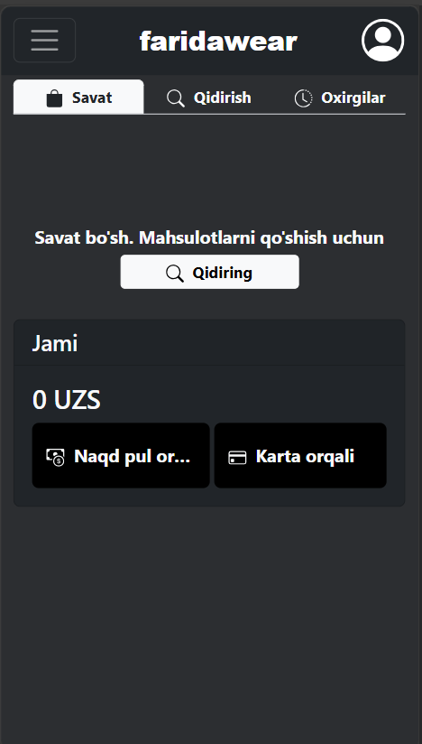
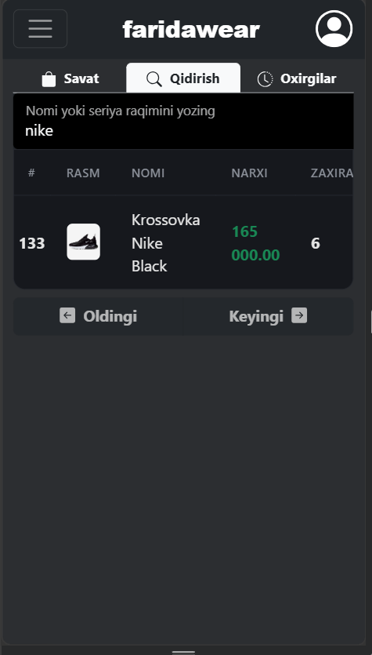
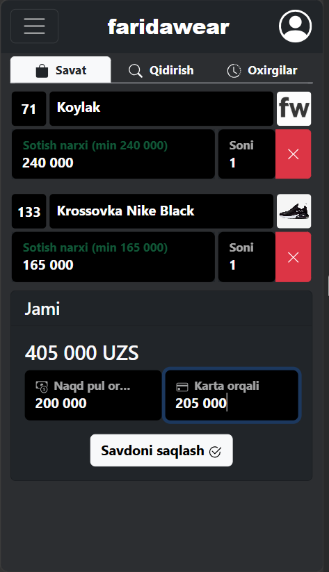
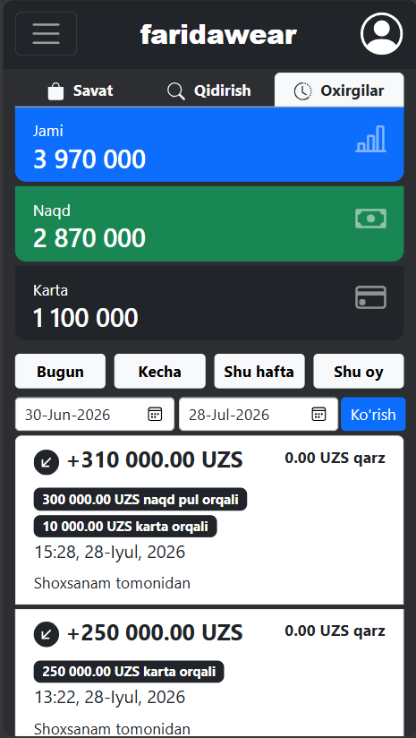
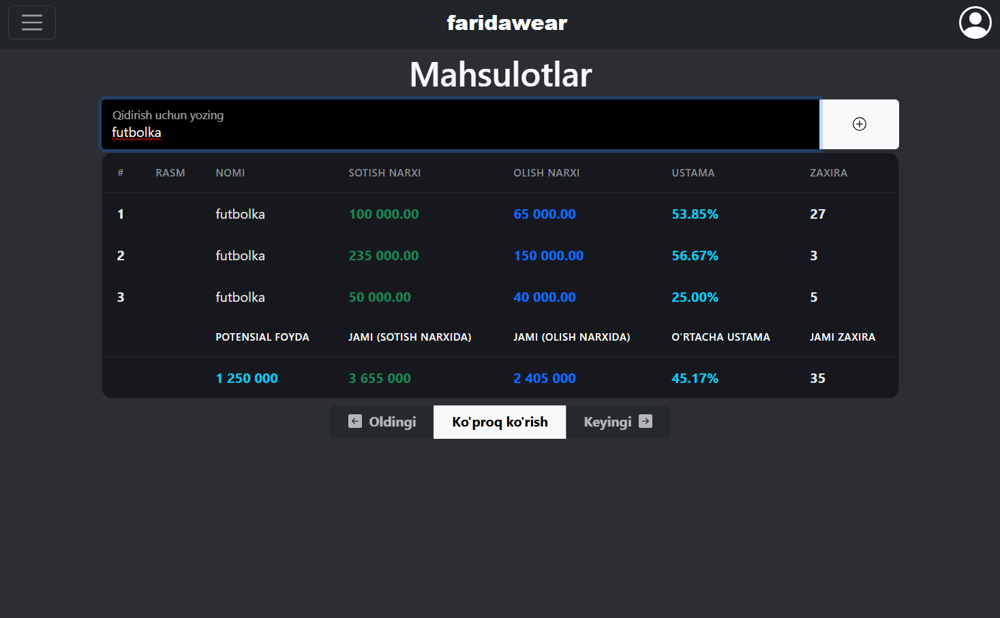

# **faridawear** (in active development)
## A simple POS and sales system (PWA-compliant web application)

It currently includes only the essential features required for production use. The system supports multiple payment methods and calculates profits using the **cumulative method**. It ensures accurate financial calculations, even when processing complex transactions, with no missing or excess funds. Additional features are currently being implemented.

### The system is currently on production server: [fw.eliteschool.me](https://fw.eliteschool.me/)

## POS interface

### Adding items to the cart

## Recent sales

### You can view sales statistics for a custom date range.

## Products page

## Login page

## **The web app is compatible with both desktop and mobile devices.**

### ***More features coming soon.***